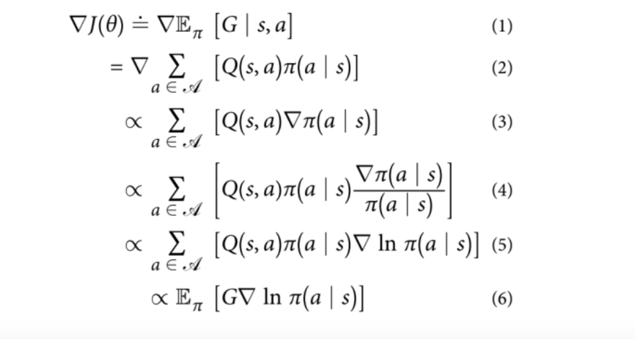

<style>
body {
  background: linear-gradient(to bottom right, #F2F2F2, #E6E6E6);
}
</style>


```{r setup, include=FALSE}
knitr::opts_chunk$set(warning=FALSE,
                      message=FALSE,
                      echo=FALSE,
                      dpi=300)

# Load the required libraries
library(quantmod) # alternative library for stock data
library(ReinforcementLearning)
library(TTR) # for technical analysis functions
library(ggplot2) # for data visualization
library(dplyr) # for data manipulation
library(DT)
library(htmltools)
library(fBasics) # for financial returns and related quantities
library(gridExtra)
library(reshape2)
library(knitr)
library(cowplot)
```

```{r echo=FALSE}
bytes <- file.size("index.Rmd")
words <- bytes/10
minutes <- words/200
```


<center>
**Reading Time: `r round(minutes)` minute(s)**
</center>
<br>

<figure>
  <center>
    
    <figcaption>Image Source:[CNET](https://www.cnet.com/personal-finance/investing/its-been-a-wild-ride-stock-market-predictions-for-the-next-year/) </figcaption>
  </center>
</figure>


# Introduction

## Learning by Reward


```{r, echo=FALSE, results='asis'}


div(
  style = "display: flex;",
  div(
    style = "flex: 1;",
   tags$p(
      "Imagine you are trying to train a group of monkeys to play basketball. Every time a monkey makes a successful shot, you give it a banana. If the monkey misses the shot, you do not give it a banana. Over time, the monkeys start to associate making successful shots with receiving a banana and start to develop strategies to improve their chances of making a successful shot, such as passing the ball to a teammate or practicing their aim. Better still, Imagine you are training a robot to do laundry. You set up a reinforcement learning algorithm where the robot receives a positive reward (high five) when it successfully sorts the clothes, adds the correct amount of detergent, and washes the clothes without damaging them. "
    ),
    tags$p(
      "The robot receives a negative reward (no high five) if it damages the clothes, spills detergent, or makes a mistake in the sorting process. At first, the robot has no idea how to do laundry. It may accidentally mix whites and colors or add too much detergent, resulting in negative rewards. However, through trial and error, the robot gradually learns the correct sequence of actions to take when doing laundry. As the robot continues to do laundry over time, the robot starts to associate successfully washing and drying laundry with receiving a high-five and starts to optimize its laundry skills to maximize the chances of getting a high-five. It refines its strategy and learns to adapt to several types of fabrics and stains. It may adjust the water temperature, or the amount of detergent based on the type of fabric being washed or selecting the correct cycle."
    )
  ),
 div(
    style = "flex: 1; text-align: center;",
    tags$a(href = "https://tenor.com/en-GB/view/robot-laundry-overdrying-ez2on-happy-gif-25415746", 
           target = "_blank", "Source: Robot Laundry GIF"),
    tags$img(src = "Figures/robot-laundry.gif", width = "100%")
  ),
  align = "top"
)

```


Over time, the robot becomes your skilled laundry assistant, capable of doing laundry efficiently and effectively. Now imagine that you change the scenario by adding a new type of fabric or stain that the robot has never encountered before. The robot may initially struggle to determine the correct cycle or water temperature or detergent amount to use. However, by experimenting with different settings and observing the results, the robot can learn to adjust its strategy to handle the new fabric or stain type. These are just a few examples of reinforcement learning. The robot/monkeys are the <span style="color:black; font-weight:bold;">agents</span>, the shot/laundry task are the <span style="color:black; font-weight:bold;">actions</span>, the banana/high-five are the <span style="color:black; font-weight:bold;">rewards</span>, and the association between the action and the reward is the <span style="color:black; font-weight:bold;">policy</span>. By using a reward signal to guide the agents' behavior, you can train them to learn a specific task or behavior. This also demonstrates how reinforcement learning algorithms can adapt to new and unexpected situations, even in complex tasks like doing laundry.

## Stock Trading

```{r}
div(
  style = "display: flex;",
  div(
    style = "flex: 1;",
    tags$p(
      "How can we teach a 10-year-old to trade stocks? First of all, we start with basics of risks and rewards. Tell them to forget about lemonade stands and allowance money, we are talking real cash here. Let them imagine playing a game where they get to buy and sell imaginary items, like Pokemon cards or Beanie Babies. They should want to buy low and sell high to make a profit, just like in real life. The game is called RL, that's right, it stands for \"Real\" Life and the stakes are high, but the rewards can be even higher. Now, here's where things get tricky. RL isn't like other games where they can just hit \"reset\" and start over if you mess up. They have to learn from their mistakes and make smarter choices next time. So, one should do their research, pay attention to trends, and don't be afraid to take risks (but not too many!). It's all about balancing risk and reward, just like in RL."
    ),
    style = "align: bottom;"
  ),
  div(
    style = "flex: 1; text-align: center; position: relative;",
    tags$img(src = "Figures/stock.jpg", width = "100%"),
    tags$p(
      style = "position: absolute; bottom: 0; left: 0; right: 0; margin: auto;",
      tags$a(href = "https://datascience.columbia.edu/wp-content/uploads/2020/12/34_JPMorgan_Reinforcement-Learning-for-Trading.pdf", 
             target = "_blank", "Source: JPMorgan")
    )
  )
)


```

In the world of stock trading, timing is everything. It is no secret that the stock market is unpredictable, with prices rising and falling based on everything from global events to social media trends. Recently, stocks like Bitcoin, Dogecoin, GameStop and Tesla have captured the attention of investors and the public alike [@mishra2022social]. Whether it is buying low and selling high or knowing when to hold onto a stock for the long term, making the right decision can mean the difference between profit and loss. But how can traders stay on top of market trends and make informed decisions in such a volatile environment? Is it possible to automate trading entirely for traders who want to trade 24/7 but do not want to be glued to their screens all the time? One answer is reinforcement learning, a form of machine learning that trains algorithms to learn from past actions and outcomes and make better decisions over time [@sutton1998introduction; @sutton2018reinforcement]. In this project, we will explore the application of reinforcement learning in stock trading and how this can potentially change the way we think about financial investment decisions.


# What is Reinforcement Learning?

Reinforcement learning (RL) is a type of machine learning algorithm that enables an agent to learn how to make decisions based on rewards and punishments. It involves an agent interacting with an environment, taking actions, receiving feedback, and adjusting its behavior based on that feedback [@sutton2018reinforcement]. The goal of RL is to optimize the agent's behavior to maximize the cumulative reward it receives over time. RL algorithms are used in various applications such as robotics, gaming, finance, and natural language processing [@ibarz2021train; @kaiser2019model; @charpentier2021reinforcement;@li2017deep]. RL is based on the concept of trial and error. We can consider an individual placed in an unfamiliar environment. Initially, mistakes may occur, but through learning from them, they can avoid repeating them in the future when faced with similar circumstances. RL employs a similar approach in training its model, whereby the agent tries different actions and observes the resulting rewards or punishments, and then adjusts its behavior to maximize the expected reward in the future. 

## Mathematical Nature of Reinforcement Learning 

We can illustrate the nature of reinforcement learning as follows: at each sequence of discrete time points (or steps), with t = 0, 1, 2, 3, etc., the agent and environment interact. The agent receives information about the environment’s state, $s_t$ within S, at each time point/step, t, where S represents the set of possible states, which on this basis, selects an action from A($s_t$), the set of actions to choose from. The agent receives the numerical reward within R, and then finds itself under a new state [@wiering2012reinforcement]. The diagram below illustrates this process:

<br>

<figure>
  <center>
    
    <figcaption>The agent-environment interaction in RL framework (Source: Sutton and Barto, 2018)</figcaption>
  </center>
</figure>

<br>

The goal of reinforcement learning (RL) can be summarized as finding a policy that maximizes the expected cumulative reward over a sequence of interactions between an agent and its environment. Mathematically, this can be expressed as:


$$\boldsymbol{maximize~ E[R] = \max_{\pi} E\left[\sum_{t=0}^{\infty} \gamma^t r_t\right]}$$

where $\boldsymbol{E[R]}$ is the expected cumulative reward, $\boldsymbol{\gamma}$ is the discount factor ($0 \leq \gamma \leq 1$), $\boldsymbol{r_t}$ is the reward obtained at time $\boldsymbol{t}$, and the summation is taken over all time steps from $\boldsymbol{t=0}$ to $\boldsymbol{t=\infty}$.

The objective function in RL is typically the expected cumulative reward, which is also known as the return. This function is used to evaluate the performance of a policy, which maps states to actions. The objective is to find the policy that maximizes the expected return over a given time horizon.

The objective function can be expressed as:

$$\boldsymbol{J(\pi) = E_{\pi}\left[\sum_{t=0}^{\infty} \gamma^t r_t\right]}$$

where $\boldsymbol{J(\pi)}$ is the expected return for policy $\boldsymbol{\pi}$, $\boldsymbol{E_{\pi}}$ is the expectation over the distribution of trajectories generated by following policy $\boldsymbol{\pi}$, and the summation is taken over all time steps from $\boldsymbol{t=0}$ to $\boldsymbol{t=\infty}$.

The goal of RL is to find the policy $\boldsymbol{\pi^*}$ that maximizes the objective function $\boldsymbol{J(\pi)}$, i.e.,

$$\boldsymbol{\pi^* = \arg\max_{\pi} J(\pi)}$$
Since the challenge that remains is to nudge the policy parameters such that the return can be maximized, we can meet this goal by using the gradient of the objective function. This is known as vanilla gradient ascent. We should note that gradient descent and gradient ascent are synonymous, with only a sign change being the notable difference (sign change is moved to downhill for gradient descent) [@d2020reinforcement].

**Policy Gradient Theorem**

<figure>
  <center>
    
    <figcaption>The gradient of a policy (Source: D, P.W.P., 2020)</figcaption>
  </center>
</figure>

<br>

In step 1, we observe that our goal is to find the gradient of the objective function. Then, within step 2, the expected return is replaced with an implementation (can be any of your choice), however it is usually easier to proceed with the action-value function. We denote the expected return as equivalent to each action's (Q) value multiplied by the probability that the particular action is visited (which is defined by the policy, $\pi$).

We take the gradient with respect to the parameters of the policy. Therefore, we can move Q, the action value function, outside of the calculation of the gradient (as defined in step 3). Proceeding with our steps, for step 4, we multiply the entire equation by $\pi$(a | s)/$\pi$(a | s), which is equivalent to one. Therefore, the equation is not altered. For step 5, we proceed with a typical mathematical identity, which replaces the fraction with a natural logarithm. This is a fairly standard computational trick, where we prevent the multiplication of small probabilities, which can make the gradients zero (also known as the vanishing gradient problem). Finally, for step 6, we can remember that the summation of action values, which are multiplied by the probabilities for the action, are what we started with in step 2. However, as a substitute to summing over the actions, we instruct the agent to adhere by the policy and return the expectation of the specified action over time [@d2020reinforcement].

## Key Elements of Reinforcement Learning

- **Agent:** The agent in RL is the decision-making entity that interacts with the environment. In the stock trading analogy, the agent could be the trader who decides when or which stocks to buy and sell.

- **Environment:** The environment in RL is the world in which the agent operates and interacts with. In the stock trading analogy, the environment would be the stock market, which includes all the stocks, their prices, and the various events that affect the market.

- **State (S):** A state in RL refers to the current situation of the environment, as observed by the agent. In the stock trading analogy, a state would include the current prices of the stocks the trader is interested in, the current state of the economy, and any other relevant factors that may influence the decision to buy or sell.

- **Policy ($\pi$):** A policy in RL is a set of rules or instructions that the agent uses to determine its actions in a given state. In the stock trading analogy, a policy could be the algorithm that the agent uses to determine which stocks to buy and sell based on the current state.

- **Action (A):** In RL, the action is the decision made by the agent based on the current state and the policy. In the stock trading analogy, the action would be the trader's decision to hold, buy or sell a specific stock.

- **Reward (R):** A reward in RL is a feedback signal that the agent receives after taking an action. It indicates how good or bad the action was in achieving the agent's objective. In the stock trading analogy, the reward would be the profit or loss made from the trade.

- **Penalty:** A penalty in RL is a negative feedback signal that the agent receives after taking an action that is not desired or expected. In the stock trading analogy, the penalty would be the loss incurred from a bad trade or missed opportunity..


## Advantages of Reinforcement Learning

- Learning through trial and error: Unlike supervised learning, where the algorithm is provided with labeled data, RL algorithms learn by trial and error, without explicit supervision thus making it well-suited for applications where it is difficult or impractical to provide labeled data.

- Flexibility: RL can be used in both single-agent and multi-agent settings. In a single-agent setting, the agent learns to optimize its behavior by interacting with the environment while in a multi-agent setting, multiple agents learn to interact with each other and optimize their behavior collectively. 

- Adaptability: RL algorithms can adapt to changes in the environment and adjust their behavior accordingly. This makes RL well-suited for dynamic and uncertain environments where traditional machine learning approaches may struggle.

- Exploration: RL algorithms are designed to explore new strategies and actions in order to maximize their rewards. This can lead to the discovery of novel solutions and approaches that may not have been considered otherwise.

## Challenges of Reinforcement Learning

- Exploration-exploitation tradeoff: RL algorithms need to balance between exploring the environment to find new and potentially better actions, and exploiting the knowledge they already have to maximize rewards in the past. This tradeoff can be challenging, especially in complex environments with many possible actions.

- Generalization: RL algorithms may struggle to generalize their learned policies to new, unseen environments or tasks that were not encountered during training, which can limit their usefulness in practice.
Data efficiency: RL algorithms typically require a large amount of data to learn a good policy, which can be time-consuming and expensive to obtain.

- Reward engineering: The quality of the learned policy depends heavily on the reward function used, which can be difficult to design in a way that accurately reflects the desired behavior.

- Safety and ethics: RL agents can learn to take actions that are harmful or unethical, especially if the reward function is not carefully designed or the agent's behavior is not appropriately constrained.

- Interpretability: RL algorithms can be difficult to interpret and explain, especially when they use complex models or operate in high-dimensional state and action spaces.


# Reinforcement Learning Algorithms

There are several categories of reinforcement learning algorithms that can be used for stock trading, including:

- **Model-Based Reinforcement Learning Algorithms:** These algorithms learn the model from data and use it to optimize the agent's behavior and plan actions that maximize the expected cumulative reward to predict the outcomes of actions. Model-based algorithms are computationally efficient and require less data to learn than model-free algorithms. However, they may suffer from errors in the learned model, which can lead to sub optimal behavior. Examples of model-based reinforcement learning algorithms for stock trading include: Dynamic Programming, Monte Carlo methods and Temporal Difference Learning

- **Value-Based Reinforcement Learning Algorithms:** These are model-free that  learn an estimate of the optimal value function and use it to derive an optimal policy. These  algorithms are more robust to errors in the environment model, but they require more data to learn and can be computationally expensive. Examples of value-based reinforcement learning algorithms for stock trading include: Q-Learning, Deep Q-Networks (DQNs), and Double DQNs.

- **Policy-Based Reinforcement Learning Algorithms:** These algorithms learn the optimal policy directly, without estimating the value function. Examples of policy-based reinforcement learning algorithms for stock trading include:REINFORCE, SARSA, Proximal Policy Optimization (PPO) and Actor-Critic

- **Hybrid Reinforcement Learning Algorithms:** These algorithms combine elements of value-based and policy-based reinforcement learning. Examples of hybrid reinforcement learning algorithms for stock trading include: Trust Region Policy Optimization (TRPO) and Asynchronous Advantage Actor-Critic (A3C)

In practice, the choice of reinforcement learning algorithm for stock trading depends on the specific task and the characteristics of the environment. For example, a value-based algorithm like DQN may be well-suited for a simple trading environment with discrete actions, while a policy-based algorithm like PPO may be better for a more complex environment with continuous actions. Each of these algorithms has different advantages and disadvantages, and their performance can vary depending on the specific problem being addressed and on several factors, such as: (1)Efficiency and speed of convergence, (2) Performance on historical data, (3) Robustness to market changes, (4) Ability to handle high-dimensional state and action space, and (5) Interpretability: how easily the algorithm's decisions can be interpreted and understood. Ultimately, the choice of algorithm will depend on the specific goals of the trader, the particular characteristics of the stock market being traded, and the desired performance metrics.


Next, we expand more on the algorithms we will use for our data

## 1. Q-Learning

Q-learning [@watkins1992q] is a popular value-based reinforcement learning algorithm based on the well known Bellman equation:

<figure>
  <center>
    
</figure
<br>

Where; V(s) is the value of the current state s,  E refers to the expectation, while λ refers to the discount factor that determines the importance of future rewards.  From the above definition of the Bellman’s equation, the action value function can be expressed as:

<figure>
  <center>
    
</figure
<br>

In Q-learning, the agent uses an iterative approach to update the Q-function estimates and learn an estimate of the optimal action-value based on the rewards obtained from each function. The optimal Q-value, denoted as Q* can be expressed as:

<figure>
  <center>
    
</figure
<br>

In the context of stock trading, Q-learning can be used to learn the optimal buying and selling decisions for a given stock, based on historical price data and other market indicators. The agent can learn to maximize its expected profit over a given time horizon, taking into account the risks and uncertainties associated with stock trading. The Q-learning algorithm can be described by the following update rule:

<figure>
  <center>
    
</figure
<br>
Where α is the learning rate, which determines the extent to which new information overrides old information and how fast we approach our goal. 

The algorithm is summarized as below:

```{r echo=FALSE}
#the image of the neural network algorithm trained via Bayesian
fig1<-"Figures/q-learning.png"
```

<center>
](`r fig1`)

## 2. State-Action-Reward-State-Action (SARSA)

SARSA (State-Action-Reward-State-Action) is a RL algorithm that is used for online and on-policy learning. It is similar to Q-learning, but instead of updating the Q-value of the current state-action pair using the maximum Q-value of the next state, SARSA updates the Q-value using the Q-value of the next state-action pair, that is, it learns the Q-value of the policy being followed [@sutton1998introduction]. The SARSA algorithm can be described by the following update rule:

<figure>
  <center>
    
</figure
<br>

where: $Q(s_t, a_t)$ is the Q-value of the current state-action pair $(s_t, a_t)$; $\alpha$ is the learning rate that determines the impact of the new information on the existing Q-value; $r_{t+1}$ is the reward obtained after taking action $a_t$ in state $s_t$; $\gamma$ is the discount factor that determines the importance of future rewards; $Q(s_{t+1}, a_{t+1})$ is the Q-value of the next state-action pair $(s_{t+1}, a_{t+1})$ obtained using the current policy.

The algorithm is summarized as below:

```{r echo=FALSE}
#the image of the neural network algorithm trained via Bayesian
fig2<-"Figures/sarsa2.jpg"
```

<center>
](`r fig2`)


## 3. Deep Q-network (DQN)

Deep Q-Network (DQN), is a type of RL algorithm that was introduced in 2015 and uses deep neural networks to approximate the Q-values of state-action pairs in a Markov decision process [@mnih2015human]. 

<figure>
  <center>
    
    <figcaption>The agent-environment interaction in Deep Reinforcement Learning [@mao2016resource]
    </figcaption>
  </center>
</figure
<br>

The DQN algorithm uses experience replay and target networks to improve the stability and efficiency of the learning process. Experience replay involves storing the agent's experiences (i.e., state, action, reward, next state) in a replay buffer and sampling mini-batches of experiences randomly from the buffer to train the neural network. 

Target networks involve creating a separate neural network with the same architecture as the Q-network but with frozen weights to estimate the target Q-values used in the Bellman equation. This reduces the correlation between the target and predicted Q-values, which improves the stability of the learning process. 

The update equation for Deep Q-Network (DQN) algorithm can be written as follows:

$$
Q(s,a) = Q(s,a) + \alpha [r + \gamma \max_{a'} Q'(s',a') - Q(s,a)]
$$
Where: $Q(s,a)$ is the estimated Q-value for state s and action a; $r$ is the reward obtained after taking action a in state $s; s'$ is the next state after taking action $a$ in state $s; a'$ is the action with the highest Q-value in state $s'; Q'(s',a')$ is the target Q-value for the next state-action pair, computed using a separate target network that is periodically updated with the main network; $\alpha$ is the learning rate; $\gamma$ is the discount factor, which determines the weight given to future rewards.

The algorithm is summarized as below:


```{r echo=FALSE}
#the image of the neural network algorithm trained via Bayesian
fig3 <-"Figures/dqn.jpg"
```

<center>
![DQN pseudo code[@mnih2015human]](`r fig3`)


## 4. A2C (Advantage Actor-Critic) 

A2C is a reinforcement learning algorithm that combines the advantages of two other reinforcement learning algorithms: the actor-critic method and the advantage function. In A2C, an actor learns to select actions, and a critic learns to evaluate the value of state-action pairs. The advantage function is used to estimate the advantage of taking a specific action in a given state compared to taking the average action in that state.

Mathematical Notation:

> **S:** set of possible states
>
> **A:** set of possible actions
>
> **$\pi(a|s;θ):$** policy function, which maps a state s to a probability distribution over actions a, parameterized by θ
>
> **V(s;w):** state value function, which estimates the expected return starting from state s, parameterized by w
>
> **Q(s,a;w):** action value function, which estimates the expected return starting from state s and taking action a, parameterized by w
>
> **R:** reward function, which maps a state-action pair (s,a) to a scalar reward value
>
> **γ:** discount factor, which determines the relative importance of immediate and future rewards

The A2C algorithm combines the actor-critic method and the advantage function to estimate the optimal policy for a given reinforcement learning problem. The actor component of A2C learns to select actions based on the current policy $\pi$, while the critic component evaluates the value of state-action pairs using the state value function $V$ and action value function $Q$.

During training, the actor and critic are updated based on the temporal difference (TD)) error, which is the difference between the estimated value of a state-action pair and the actual observed reward. The TD error is used to update the actor's policy $\pi$ and the critic's value functions $V$ and $Q$. The A2C algorithm uses the advantage function to estimate the advantage of taking a specific action in a given state compared to taking the average action in that state.

The advantage function is defined as $A(s,a) = Q(s,a) - V(s)$, where $A(s,a)$ is the advantage of taking action a in state $s$, $Q(s,a)$ is the estimated value of taking action $a$ in state $s$, and $V(s)$ is the estimated value of being in state $s$. The advantage function is used to update the actor's policy $\pi$ using the policy gradient method, which updates the policy parameters $\theta$ in the direction that maximizes the expected return.

Overall, A2C is a powerful reinforcement learning algorithm that combines the strengths of the actor-critic method and the advantage function to learn an optimal policy for a given task. By estimating the advantage of taking specific actions in different states, A2C can learn more efficiently and achieve better performance than other reinforcement learning algorithms.

## Exploration vs Exploitation


The process of learning in RL is through exploration and exploitation [@powell2008optimal]. Exploration involves selecting actions that the agent has not taken before and is a crucial aspect of RL as it helps the agent to enhance its current knowledge of each action by discovering new states and actions that can potentially lead to a higher rewards. By improving the precision of the estimated action-values, the agent can make more informed decisions in the future, leading to better performance.


On the other hand, exploitation selects the action that appears to offer the greatest reward by utilizing the agent's current action-value estimates. However, pursuing greedy actions based on action-value estimates may not necessarily lead to the optimal solution, resulting in sub-optimal behavior. Exploration provides the agent with more accurate estimates of action-values, whereas exploitation may yield more rewards. However, the agent cannot pursue both simultaneously, creating a dilemma known as the exploration-exploitation tradeoff.

- **Greedy Policy:** The agent takes the action with the maximum Q value at any state in the environment in the greedy policy exploration. This approach ensures the agent takes the optimal action at each step, but it has the obvious shortcoming of never exploring any other action other than the optimal one, leading to sub-optimal solutions.


- **Epsilon-greedy** exploration is another popular exploration strategy in RL, which involves selecting a random action with a certain probability (epsilon) and selecting the action with the highest expected reward with a probability of 1-epsilon [@singh2000convergence; @powell2008optimal]. Epsilon-greedy exploration strikes a balance between exploration and exploitation, and it is particularly useful when the agent has some prior knowledge of the environment. However, this strategy can lead to sub optimal solutions if the agent gets stuck in a local maximum.

- **Thompson sampling** [@agrawal2013thompson] is a more sophisticated exploration strategy that involves selecting actions based on the probability of their being optimal. This strategy involves maintaining a probability distribution over the possible rewards of each action and then selecting the action with the highest expected reward according to this distribution. Thompson sampling is particularly useful in situations where the environment is complex and dynamic and where it is not clear which actions will lead to a higher reward. However, this strategy can be computationally expensive and difficult to implement in practice.


# Previous Work

Reinforcement learning (RL) is an effective approach for building intelligent trading agents in stock markets. Among various RL algorithms, Q-learning, SARSA, and Deep Q-Network (DQN) are the most popular ones. Q-learning is a model-free RL algorithm that uses the Q-function to approximate the optimal policy. The Q-value of each action-state pair is updated using the Bellman equation. A recent study conducted by Gupta and Sharma (2021) proposed a Q-learning-based trading algorithm that uses technical indicators as the state space and predicts future price movements to make trading decisions. The results showed that the proposed algorithm outperformed the traditional buy-and-hold strategy and other benchmark algorithms in terms of cumulative returns.

SARSA is another popular RL algorithm that is used for trading in stock markets. Unlike Q-learning, SARSA is an on-policy algorithm that uses the SARSA Q-function to estimate the expected future rewards. A recent study conducted by Jiang and Yao (2020) proposed a SARSA-based algorithm that used technical indicators as input features to predict the stock prices and make trading decisions. The results showed that the SARSA-based algorithm outperformed the buy-and-hold strategy and other benchmark algorithms in terms of cumulative returns and Sharpe ratio.

Deep Q-Network (DQN) is a popular RL algorithm that uses deep neural networks to approximate the Q-function. A recent study conducted by Feng et al. (2020) proposed a DQN-based trading algorithm that used technical indicators and market news as input features to predict the stock prices and make trading decisions. The results showed that the DQN-based algorithm outperformed the traditional buy-and-hold strategy and other benchmark algorithms in terms of cumulative returns and Sharpe ratio. Moreover, the DQN-based algorithm was found to be more robust to noise and uncertainties in the stock market compared to other algorithms.

When using RL for trading, the figure below shows a general expectation of the trading decisions made by the interaction of the agent and states in the stock trading environment.

<figure>
  <center>
    
    <figcaption>Image Source:[QUANT INSTI](https://blog.quantinsti.com/reinforcement-learning-trading/)
    </figcaption>
  </center>
</figure>

<br>


# <span style="color:blue">Application to Stock Data</span>


In this section, we will explore data from the stock market, downloaded from yahoo finance (2010-2022) and show implementation of the RL algorithms discussed in the previous section. Below are the variable descriptions for stock data:

> **symbol:**  The name or ticker symbol of the stock, Apple (AAPL), Amazon (AMZN), Johnson & Johnson stock (JNJ), and NFLX. 
>
> **date:** The date of the stock price.
>
> **open:** The opening price of the stock on a given day.
>
> **high:** The highest price that the stock traded at during the day.
>
> **low:** The lowest price that the stock traded at during the day.
>
> **close** The price at which the stock closed for trading on that particular day.
>
> **volume:**The number of shares of the stock that were traded on a given day.
>
> **adjusted:** The adjusted closing price of the stock on a given day, which takes into account any corporate actions, such as stock splits or dividends, that affect the stock price.


To download stock data for Apple, Amazon, Johnson & Johnson, and Netflix in R, we can use the `tidyquant` package. 

```{r, echo=TRUE}
library(tidyquant) # for stock data

# Define a vector with the stock symbols of interest
symbols <- c("AAPL", "AMZN", "JNJ", "NFLX")

# Use the tq_get() function to download the stock data for each symbol and bind them into one data frame
stocks_data <- symbols %>%
  tq_get(get = "stock.prices", from = "2010-01-01", to = "2022-12-31") %>%
  group_by(symbol) %>%
  mutate(date = as.Date(date)) %>%
  ungroup() %>%
  select(symbol, date, everything())
```


```{r, echo=FALSE, eval=FALSE}
# Split the data into train and test sets by year
stocks_train <- stocks_data %>%
  filter(year(date) %in% 2010:2016)

# Write the data frame to a CSV file
write.csv(stocks_train, "train.csv", row.names = FALSE)

stocks_test <- stocks_data %>%
  filter(year(date) %in% 2017:2022)

# Write the data frame to a CSV file
write.csv(stocks_test, "test.csv", row.names = FALSE)

```


```{r, echo=FALSE, warning=FALSE}

# create a data table with DT
datatable(stocks_data, caption = "Data sets for stocks used",
          options = list(pageLength = 10, lengthMenu = c(5, 10, 15)))
```


```{r}

# Convert the date column to a Date format
stocks_data$date <- as.Date(stocks_data$date)

# Create a ggplot object with the closing price plotted against the date, colored by the stock symbol
ggplot(stocks_data, aes(x = date, y = close, color = symbol)) +
  geom_line(size=1) +
  labs(title = "Closing Price of Stocks", x = "Date",
       y = "Closing Price", color = "Stock Name") +
  scale_x_date(date_labels = "%Y", date_breaks = "2 year") +
  theme_tq_dark() +
  theme(plot.title = element_text(hjust = 0.5)) 


```


```{r}

# Calculate the 20-day and 50-day moving averages for each stock using the SMA() function from the TTR package
stocks_data <- stocks_data %>%
  group_by(symbol) %>%
  mutate(ma10 = SMA(adjusted, n = 10),
         ma20 = SMA(adjusted, n = 20),
         ma50 = SMA(adjusted, n = 50)) %>%
  ungroup()

# Plot the 20-day moving average for each stock
ggplot(stocks_data, aes(x = date, y = ma20, color = symbol)) +
  geom_line(size=1) +
  labs(title = "20-Day Moving Average for Each Stock",
       x = "Date", y = "Price", color = "Stock") +
  theme_tq()+
  theme(plot.title = element_text(hjust = 0.5))

```

##  <span style="color:blue">Implementation of Q-learning</span>

Our code implements the Q-learning algorithm to create a simple trading strategy for stocks. The Q-learning algorithm is a model-free reinforcement learning technique used to learn an optimal policy based on trial and error. It involves building a Q-table that maps the current state and action to the expected future reward. In this case, the state is the current stock price, and the action is either to buy or hold/sell.

The function 'Q_learning' takes a data frame of stock prices and applies the Q-learning algorithm to each stock to create a Q-matrix that stores the expected future rewards for each state-action pair. It also creates a list of Boolean Q-tables for each stock, which specify whether to buy or hold/sell at each time step based on the Q-matrix. Finally, it returns the Q-matrix, actions taken, and Q-table for each stock.

Our code then loads stock data for four companies "AAPL", "AMZN", "JNJ", "NFLX", extracts the adjusted prices, and combines them into a matrix. It performs exploratory data analysis (EDA) by plotting the distribution of prices for each stock. It then applies the 'Q_learning' function to each stock to create a list of Q-matrices, actions taken, and Q-tables.

The 'Q_learning_summary' function generates a summary table of the actions taken for each stock, converts the action codes to action names, and splits the summary table by stock. It then creates tables for action for each stock and access the Q matrix for each stock. The 'predict_prices' function predicts the prices of a stock using the Q matrix and the current prices of the stock.

```{r echo=FALSE,message=FALSE,warning=FALSE,results='hide',eval = FALSE}
#Q_learning function
Q_learning <- function(prices) {
  # Define the initial values of the Q-matrix and the learning parameters
  n <- nrow(prices)
  n_stocks <- ncol(prices)
  Q_list <- vector("list", n_stocks)
  for (j in 1:n_stocks) {
    Q_list[[j]] <- matrix(0, nrow = n, ncol = 3) # Q-matrix for stock j with 3 actions
  }
  alpha <- 0.2 # Learning rate
  gamma <- 0.9 # Discount factor
  
  # Initialize an empty vector to store the actions taken
  actions_taken <- vector("numeric", n-1)
  
  # Loop through each time step
  for (i in 2:n) {
    # Loop through each stock
    for (j in 1:n_stocks) {
      # Define the state at time t-1
      state <- prices[i-1, j]
      
      # Select the action with the highest Q-value
      q_values <- Q_list[[j]][i-1, ]
      action <- sample(which(q_values == max(q_values)), 1)
      
      # Store the action taken at time t-1
      actions_taken[i-1] <- action
      
      # Define the reward and the next state at time t
      reward <- prices[i, j] - prices[i-1, j] # The reward is the change in the price of stock j
      next_state <- prices[i, j]
      
      # Update the Q-matrix using the Q-learning algorithm
      Q_list[[j]][i, action] <- Q_list[[j]][i-1, action] + alpha * (reward + gamma * max(Q_list[[j]][i-1, ]) - Q_list[[j]][i-1, action])
    }
  }
  
  # Create a list of Q-tables for each stock
  Q_table <- lapply(Q_list, function(x) {
    buy_action <- x[, 1] > x[, 2] & x[, 1] > x[, 3] # Buy if Q-value of buy is greater than Q-value of hold/sell
    sell_action <- x[, 2] > x[, 1] & x[, 2] > x[, 3] # Sell if Q-value of sell is greater than Q-value of hold/buy
    hold_action <- !buy_action & !sell_action # Hold if none of the above is true
    data.frame(Buy = buy_action, Sell = sell_action, Hold = hold_action)
  })
  
  # Return the list of Q-matrices (one for each stock), actions taken, and Q-tables
  return(list(Q_list = Q_list, actions_taken = actions_taken, Q_table = Q_table))
}
```

```{r echo=FALSE,message=FALSE,warning=FALSE,results='hide',eval = FALSE}
# Load the stock data
data <- getSymbols(c("AAPL", "AMZN", "JNJ", "NFLX"), src = "yahoo", from = "2010-01-01", to = "2022-12-31", auto.assign = TRUE)
# Extract adjusted prices
AAPL_prices <- Ad(AAPL)
AMZN_prices <- Ad(AMZN)
JNJ_prices <- Ad(JNJ)
NFLX_prices <- Ad(NFLX)
# Combine the stock price vectors into a matrix
prices <- cbind(AAPL_prices, AMZN_prices, JNJ_prices,NFLX_prices)
colnames(prices) <- gsub("\\..*", "", colnames(prices))
prices <- na.omit(prices)
prices_df <- as.data.frame(prices)
```

## Summary statistics

From the table we observe that the prices for AAPL were highly skewed compared to prices from AMZN, JNJ and NFLX with skewness 1.332973, 0.852902, 0.233780, 0.850237 respectively.

```{r echo=FALSE,message=FALSE,warning=FALSE,results='hide',eval = FALSE,fig.width = 10,fig.height=5}
# generate summary statistics for the prices data
summary_prices <- as.data.frame(basicStats(prices_df))
# create the table using kable
results <- kable(summary_prices, format = "latex", align = "c")

# print the table using kable
cat(results)
```

\begin{table}
\begin{tabular}{ccccc}
\hline
  & AAPL & AMZN & JNJ & NFLX\\
\hline
nobs & 3.272000e+03 & 3272.000000 & 3272.000000 & 3272.000000\\

Minimum & 5.837758e+00 & 5.430500 & 39.409145 & 7.018571\\

Maximum & 1.806839e+02 & 186.570496 & 181.108795 & 691.690002\\

1Quartile & 1.660096e+01 & 13.327125 & 62.507419 & 34.668928\\

3Quartile & 5.486968e+01 & 93.131001 & 126.193081 & 327.874992\\

Mean & 4.939430e+01 & 58.912957 & 97.960695 & 188.284766\\

Median & 2.734463e+01 & 36.393750 & 96.012989 & 110.114998\\

Sum & 1.616182e+05 & 192763.194847 & 320527.394296 & 616067.753871\\

SE Mean & 8.347890e-01 & 0.945406 & 0.708342 & 3.126838\\

LCL Mean & 4.775754e+01 & 57.059309 & 96.571857 & 182.154008\\

UCL Mean & 5.103106e+01 & 60.766604 & 99.349533 & 194.415524\\

Variance & 2.280165e+03 & 2924.489098 & 1641.719601 & 31990.720302\\

Stdev & 4.775107e+01 & 54.078546 & 40.518139 & 178.859499\\

Skewness & 1.332973e+00 & 0.852902 & 0.233780 & 0.850237\\

Kurtosis & 3.709760e-01 & -0.625129 & -1.084334 & -0.480602\\
\hline
\end{tabular}
\end{table}

```{r echo=FALSE,message=FALSE,warning=FALSE,results='hide',fig.align = "center",fig.height=5,fig.width=10}
# Load the stock data
library(quantmod)
data <- getSymbols(c("AAPL", "AMZN", "JNJ", "NFLX"), src = "yahoo", from = "2010-01-01", to = "2022-12-31", auto.assign = TRUE)
# Extract adjusted prices
AAPL_prices <- Ad(AAPL)
AMZN_prices <- Ad(AMZN)
JNJ_prices <- Ad(JNJ)
NFLX_prices <- Ad(NFLX)
# Combine the stock price vectors into a matrix
prices <- cbind(AAPL_prices, AMZN_prices, JNJ_prices,NFLX_prices)
colnames(prices) <- gsub("\\..*", "", colnames(prices))
prices <- na.omit(prices)
prices_df <- as.data.frame(prices)
library(ggplot2)
library(reshape2)
# Plot the distribution of prices for each stock
ggplot(melt(prices_df), aes(value, fill = variable)) + 
  geom_density(alpha = 0.5) + 
  scale_fill_manual(values = c("red", "blue", "green", "orange")) + 
  labs(x = "Adjusted Prices", y = "Density", title = "Distribution of Stock Prices")+theme_classic()
```

## Summary tables for action taken

The table shows the frequency of each action ("Buy", "Sell", "Hold") taken for each stock. For instance, for the stock "AAPL", the algorithm took the action "Buy" 2958 times, "Sell" 157 times, and "Hold" 156 times during the simulation. The same information is presented for the other three stocks ("AMZN", "JNJ", and "NFLX").

```{r echo=FALSE,message=FALSE,warning=FALSE,results='hide'}
library(kableExtra)
#Q_learning function
Q_learning <- function(prices) {
  # Define the initial values of the Q-matrix and the learning parameters
  n <- nrow(prices)
  n_stocks <- ncol(prices)
  Q_list <- vector("list", n_stocks)
  for (j in 1:n_stocks) {
    Q_list[[j]] <- matrix(0, nrow = n, ncol = 3) # Q-matrix for stock j with 3 actions
  }
  alpha <- 0.2 # Learning rate
  gamma <- 0.9 # Discount factor
  
  # Initialize an empty vector to store the actions taken
  actions_taken <- vector("numeric", n-1)
  
  # Loop through each time step
  for (i in 2:n) {
    # Loop through each stock
    for (j in 1:n_stocks) {
      # Define the state at time t-1
      state <- prices[i-1, j]
      
      # Select the action with the highest Q-value
      q_values <- Q_list[[j]][i-1, ]
      action <- sample(which(q_values == max(q_values)), 1)
      
      # Store the action taken at time t-1
      actions_taken[i-1] <- action
      
      # Define the reward and the next state at time t
      reward <- prices[i, j] - prices[i-1, j] # The reward is the change in the price of stock j
      next_state <- prices[i, j]
      
      # Update the Q-matrix using the Q-learning algorithm
      Q_list[[j]][i, action] <- Q_list[[j]][i-1, action] + alpha * (reward + gamma * max(Q_list[[j]][i-1, ]) - Q_list[[j]][i-1, action])
    }
  }
  
  # Create a list of Q-tables for each stock
  Q_table <- lapply(Q_list, function(x) {
    buy_action <- x[, 1] > x[, 2] & x[, 1] > x[, 3] # Buy if Q-value of buy is greater than Q-value of hold/sell
    sell_action <- x[, 2] > x[, 1] & x[, 2] > x[, 3] # Sell if Q-value of sell is greater than Q-value of hold/buy
    hold_action <- !buy_action & !sell_action # Hold if none of the above is true
    data.frame(Buy = buy_action, Sell = sell_action, Hold = hold_action)
  })
  
  # Return the list of Q-matrices (one for each stock), actions taken, and Q-tables
  return(list(Q_list = Q_list, actions_taken = actions_taken, Q_table = Q_table))
}
# Apply the Q-learning function to each stock
Q_list <- Q_learning(prices_df)
#==================================================
#presentation of actions taken
#==================================================
# Generate summary Action table
Q_learning_summary <- function(prices) {
  # Define the names of the actions
  action_names <- c("Buy","Sell","Hold")
  
  # Run the Q_learning function and extract the actions taken
  Q_result <- Q_learning(prices)
  actions_taken <- Q_result$actions_taken
  
  # Convert the action codes to action names
  actions_taken <- factor(actions_taken, levels = 1:3, labels = action_names)
  
  # Create a summary table of the actions taken for each stock
  summary_table <- data.frame(
    Stock = rep(colnames(prices), each = nrow(prices)-1),
    Action_Taken = actions_taken,
    stringsAsFactors = FALSE
  )
  
  # Return the summary table
  return(summary_table)
}
summary_table <- Q_learning_summary(prices_df)
summary_table

# Split summary_table by stock
stock_summary <- split(summary_table, summary_table$Stock)

#tables for action for each stock
table(stock_summary$AAPL)
table(stock_summary$AMZN)
table(stock_summary$JNJ)
table(stock_summary$NFLX)

results1 <- kable(table(stock_summary$AAPL), format = "latex", align = "c")
results2 <- kable(table(stock_summary$AMZN), format = "latex", align = "c")
results3 <- kable(table(stock_summary$JNJ), format = "latex", align = "c")
results4 <- kable(table(stock_summary$NFLX), format = "latex", align = "c")

# print the table using kable
cat(results1)
cat(results2)
cat(results3)
cat(results4)
```

\begin{table}
\begin{tabular}{ccccc}
\hline
\multirow{4}{*}{Action Taken}
&\multicolumn{4}{c}{Stock}\\
\hline
  &AAPL&AMZN&JNJ&NFLX\\
\hline
Buy&2958&2958&2958&2958\\
Sell&157&157&157&157\\
Hold&156&156&156&156\\
\hline
\end{tabular}
\end{table}

```{r echo=FALSE,message=FALSE,warning=FALSE,results='hide'}
predict_prices <- function(Q, stock_prices) {
  # Define the initial values of the state and the predicted prices vector
  state <- stock_prices[1, ]
  predicted_prices <- numeric(nrow(stock_prices))
  
  # Loop through each time step
  for (i in 1:nrow(stock_prices)) {
    # Define the action as the one with the highest Q-value for the current state
    action <- which.max(Q[i, ])
    
    # Define the predicted price as the price of the chosen action
    predicted_prices[i] <- stock_prices[i, action]
    
    # Update the state to the next state based on the chosen action
    state <- stock_prices[i, ]
  }
  
  # Return the predicted prices vector
  return(predicted_prices)
}
# Predict the closing prices for each stock using the corresponding Q-matrix
AAPL_predicted_prices <- predict_prices(Q_list$Q_list[[1]], prices_df)
AMZN_predicted_prices <- predict_prices(Q_list$Q_list[[2]], prices_df)
JNJ_predicted_prices <- predict_prices(Q_list$Q_list[[3]], prices_df)
NFLX_predicted_prices <- predict_prices(Q_list$Q_list[[4]], prices_df)
```

## Plot for predicted closing prices and Adjusted prices

The plots shows that the algorithm was able to predict closing prices with significant accuracy since the predicted closing prices are not deviating too much from the adjusted prices.

```{r echo=FALSE,message=FALSE,warning=FALSE,results='hide',fig.align = "center",fig.height=5,fig.width=10}
#Plots for the predicted closing and Adjusted prices
par(mfrow = c(2, 2))

# AAPL Plot
AAPL.df <- cbind(AAPL_predicted_prices, AAPL_prices[,1])
names(AAPL.df)[2] <- "Adjusted Prices"
names(AAPL.df)[1] <- "Closing_Price"

plot(AAPL.df, main = "AAPL.df", xlab = "Date", ylab = "Prices")

# AMZN Plot
AMZN.df <- cbind(AMZN_predicted_prices, AMZN_prices[,1])
names(AMZN.df)[1] <- "Close"
names(AMZN.df)[2] <- "Adjusted"

plot(AMZN.df, main = "AMZN.df", xlab = "Date", ylab = "Prices")

# JNJ Plot
JNJ.df <- cbind(JNJ_predicted_prices, JNJ_prices[,1])
names(JNJ.df)[1] <- "Close"
names(JNJ.df)[2] <- "Adjusted"

plot(JNJ.df, main = "JNJ.df", xlab = "Date", ylab = "Prices")

# NFLX Plot
NFLX.df <- cbind(NFLX_predicted_prices, NFLX_prices[,1])
names(NFLX.df)[1] <- "Close"
names(NFLX.df)[2] <- "Adjusted"

plot(NFLX.df, main = "NFLX.df", xlab = "Date", ylab = "Prices")
```

## Performance Check

The table above shows the performance of the predictions using mean squared error for four stocks (AAPL, AMZN, JNJ, and NFLX). For each stock, the code first predicts the prices using the Q matrices trained on the training data (2010 to 2016) and then calculates the mean squared error between the predicted prices and the actual prices in the testing data (2017 to 2022).

The mean squared error for AAPL is 161.2266, for AMZN it is 1006.65, for JNJ it is 3317.487, and for NFLX it is 91061.72. A lower mean squared error indicates better performance, therefore the predictions for AAPL are the most accurate among the four stocks.

```{r echo=FALSE,message=FALSE,warning=FALSE,results='hide'}
#===============================================================
#Train/test
#==============================================================
# Split data into training and testing sets
# Convert rownames to a column 'Date'
prices_df$Date <- rownames(prices_df)
# Convert 'Date' column to Date format
prices_df$Date <- as.Date(prices_df$Date)
# Subset the data for the training set (2010-2016)
train_prices <- subset(prices_df, Date >= as.Date("2010-01-04") & Date <= as.Date("2016-12-31"))

# Subset the data for the test set (2017-2022)
test_prices <- subset(prices_df, Date >= as.Date("2017-01-01") & Date <= as.Date("2022-05-07"))

# Apply the Q-learning function to each stock using the training data
Q_list_train <- Q_learning(train_prices)

# Access Q matrix for each stock
AAPL_Q_train <- Q_list_train$Q_list[[1]]
AMZN_Q_train <- Q_list_train$Q_list[[2]]
JNJ_Q_train <- Q_list_train$Q_list[[3]]
NFLX_Q_train <- Q_list_train$Q_list[[4]]

# Use the Q matrices to predict prices for each stock using the testing data
AAPL_predicted_prices <- predict_prices(AAPL_Q_train, test_prices)
AMZN_predicted_prices <- predict_prices(AMZN_Q_train, test_prices)
JNJ_predicted_prices <- predict_prices(JNJ_Q_train, test_prices)
NFLX_predicted_prices <- predict_prices(NFLX_Q_train, test_prices)

# Evaluate the performance of the predictions using mean squared error
AAPL_mse <- mean((AAPL_predicted_prices - test_prices[, "AAPL"])^2)
AMZN_mse <- mean((AMZN_predicted_prices - test_prices[, "AMZN"])^2)
JNJ_mse <- mean((JNJ_predicted_prices - test_prices[, "JNJ"])^2)
NFLX_mse <- mean((NFLX_predicted_prices - test_prices[, "NFLX"])^2)

# Print the mean squared error for each stock
cat("AAPL MSE:", AAPL_mse, "\n")
cat("AMZN MSE:", AMZN_mse, "\n")
cat("JNJ MSE:", JNJ_mse, "\n")
cat("NFLX MSE:", NFLX_mse, "\n")
#================================================================
```

\begin{table}
\begin{tabular}{ccccc}
\hline
  &AAPL&AMZN&JNJ&NFLX\\
\hline
MSE&161.2266&1006.65&3317.487&91061.72\\
\hline
\end{tabular}
\end{table}

##  <span style="color:blue">Implementation of SARSA</span>

#### TO DO (Rophence)
<br>

##  <span style="color:blue">Implementation of DQN</span>

#### TO DO (Anusha/Rophence)
<br>
<br>

# References

<div id= "refs"></div>
